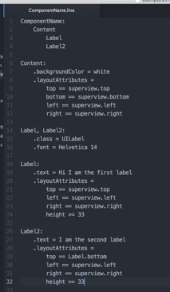
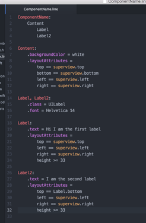

# stage-package

stage-package is a package for [Atom](https://atom.io/) that enables automatic "syntax" highlighting for .stage files.

# Installation

	git clone https://github.com/dxdp/stage-atom-package
	(HERE=$(pwd); cd ~/.atom/packages; ln -s $HERE/stage-package)

 &rarr; 
